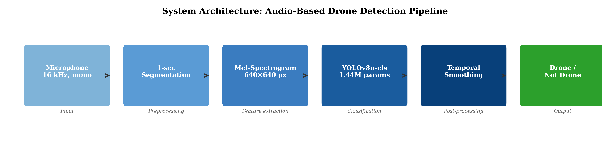
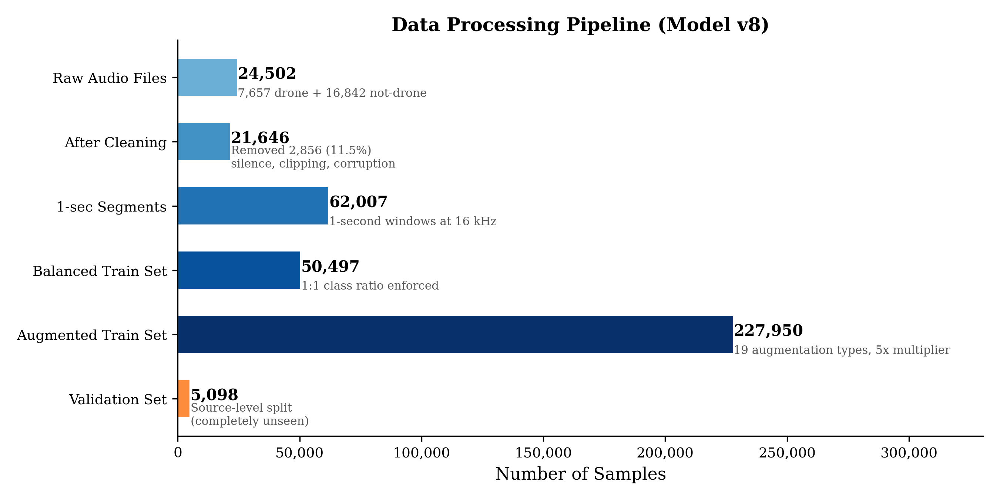
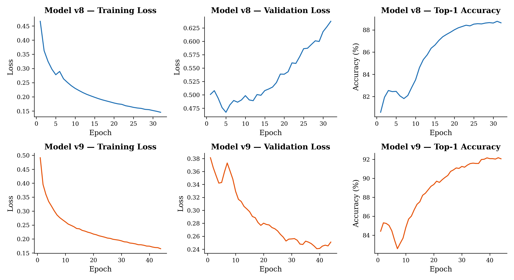
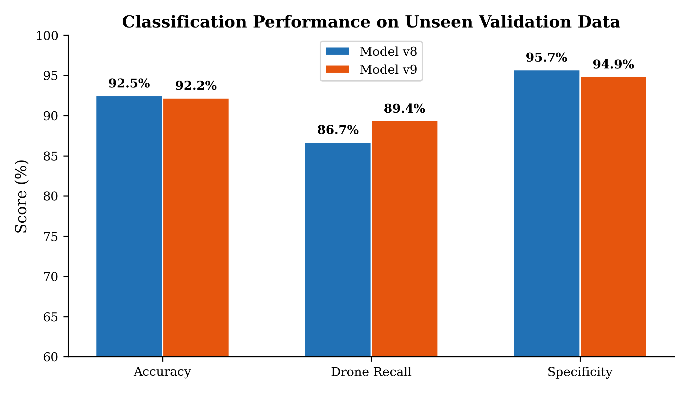
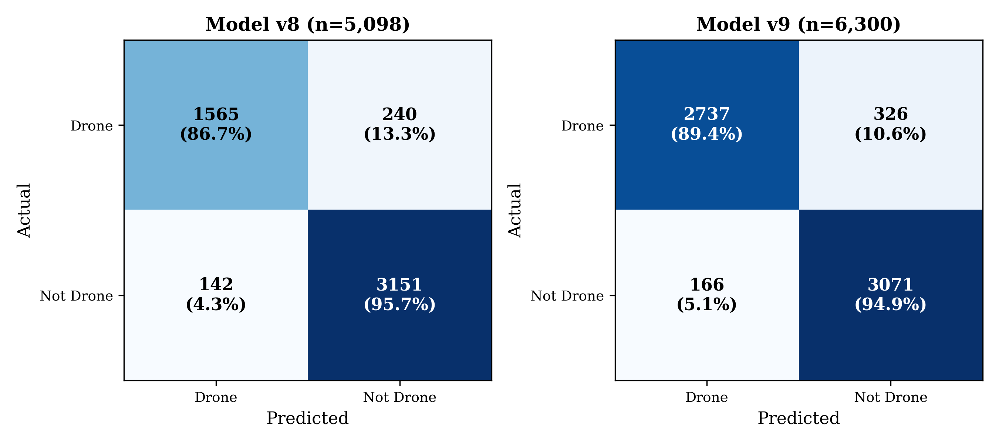
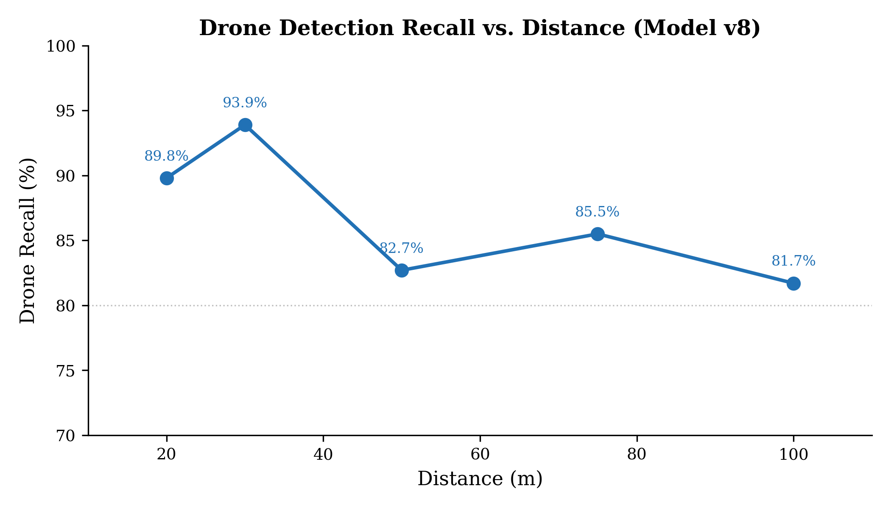
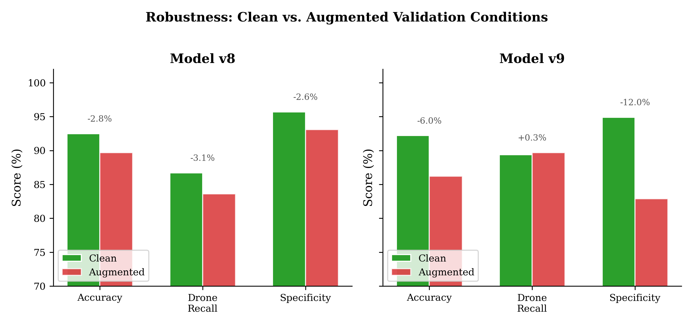
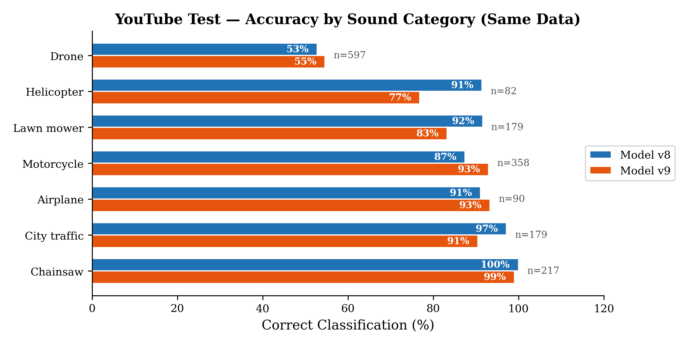
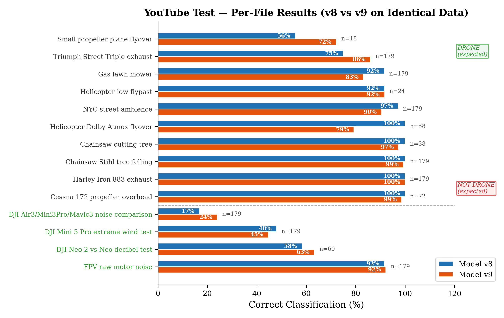
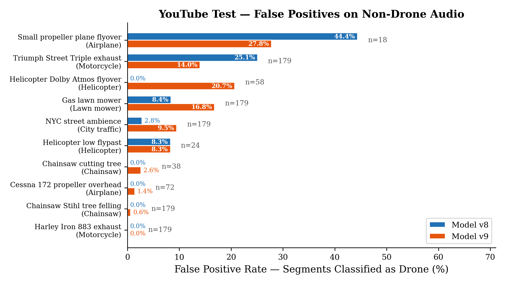

# ACOUSTIC DETECTION OF UNMANNED AERIAL VEHICLES USING MEL-SPECTROGRAMS AND YOLOv8n-cls

**Abstract.** In this article, a binary audio classification system for detecting unmanned aerial vehicles (UAVs) by their acoustic signature is presented. **The object of the study** is a lightweight drone sound detection pipeline that converts 1-second audio segments into 640×640 mel-spectrograms and classifies them using the YOLOv8n-cls neural network. **The aim of the study** is to develop a practical, edge-deployable system that achieves high accuracy on completely unseen recording setups while running on a Raspberry Pi 5 in under 500 ms per segment. **The main result of the research** is a system achieving 92.5% overall accuracy, 86.7% drone recall, and 95.7% specificity on unseen validation data, with 0% helicopter false positives and 82%+ drone detection at 100 meters distance. The model contains only 1.44 million parameters (5.6 MB ONNX). Nine model iterations revealed critical methodological insights: source-level dataset splitting eliminated data leakage, absolute dB reference in spectrogram generation improved recall by 15%, and increasing spectrogram resolution from 224×224 to 640×640 provided 12.7× more acoustic information per sample. Real-world testing on 14 YouTube audio files confirmed chainsaw rejection at 100% and FPV drone detection at 92%, while identifying remaining challenges with small propeller aircraft (44% false positive rate).

**Keywords:** drone detection; audio classification; mel-spectrogram; YOLOv8; edge deployment; UAV; binary classification; Raspberry Pi.

---

## 1. Вступ

З поширенням безпілотних літальних апаратів (БПЛА) зростає потреба у системах їх раннього виявлення. БПЛА використовуються як у цивільних цілях — логістика, картографія, моніторинг, — так і з протиправною метою: контрабанда, незаконне спостереження, порушення повітряного простору критичної інфраструктури [1, 2]. Існуючі методи виявлення — радарні, радіочастотні, візуальні — мають суттєві обмеження: радари погано фіксують малі БПЛА з низькою швидкістю [4], радіочастотні методи не працюють з автономними дронами без радіозв'язку [6], а камери залежать від освітлення та погодних умов [3].

Акустична детекція є перспективною альтернативою, оскільки дрони створюють характерний звуковий сигнал у діапазоні 100–8000 Гц, зумовлений обертанням роторів та моторів [6]. Акустичні системи працюють незалежно від погоди та видимості, мають відносно низьку вартість та можуть функціонувати цілодобово. Водночас, ефективна дальність акустичних систем обмежена 200–300 м, а міське шумове середовище створює значний фон, що ускладнює розпізнавання [7].

Метою даного дослідження є розробка легковагої, практичної системи акустичної детекції дронів, яка забезпечує високу точність на повністю невідомих записах і здатна працювати на edge-пристроях (Raspberry Pi 5) в реальному часі. Запропонований підхід полягає у перетворенні 1-секундних аудіосегментів у мел-спектрограми високої роздільності (640×640 пікселів) та їх бінарній класифікації нейромережею YOLOv8n-cls. У статті детально описано методологію, представлено результати 9 ітерацій моделі та проведено тестування на реальних аудіоданих з YouTube.

---

## 2. Аналіз існуючих рішень

Методи виявлення БПЛА можна розділити на чотири основні групи: радарні, радіочастотні, візуальні та акустичні [1].

**Радарна детекція** є традиційним підходом для виявлення об'єктів у повітрі. Проте радарні системи оптимізовані для високошвидкісних балістичних цілей і погано фіксують малі БПЛА з низькою ефективною площею розсіювання (ЕПР). Крім того, птахи та БПЛА мають схожі характеристики ЕПР, що ускладнює їх розрізнення [4]. Висока вартість та структурна складність також обмежують доступність радарних систем.

**Радіочастотна (RF) детекція** базується на перехопленні радіосигналів між БПЛА та його контролером [6]. Цей метод є пасивним (не випромінює сигнали), але має суттєве обмеження: автономні БПЛА без активного радіозв'язку залишаються невидимими для RF-систем. Крім того, при наявності кількох цілей радіосигнали можуть накладатися.

**Візуальна детекція (камери)** дозволяє ідентифікувати тип БПЛА та визначати його візуальні параметри [3]. Однак ефективність суттєво знижується вночі, у тумані, при дощі та при значній відстані до об'єкта. Тепловізійні камери частково вирішують проблему нічного спостереження, але мають обмежену роздільну здатність.

**Акустична детекція** використовує мікрофони для розпізнавання звукових хвиль роторів БПЛА [12, 7]. Переваги: незалежність від видимості та погоди, цілодобова робота, низька вартість. Обмеження: ефективна дальність 200–300 м, чутливість до фонового шуму.

У сфері акустичної детекції дронів застосовуються різні підходи машинного навчання. Dong та співавтори [8] розробили систему детекції звуку дронів на основі фьюжну ознак з використанням глибокого навчання. Tejera-Berengue та співавтори [9] дослідили вплив відстані та навколишнього середовища на якість акустичної детекції БПЛА. Mrabet та співавтори [10] систематизували алгоритми машинного навчання для виявлення та класифікації дронів, виокремивши ключові переваги та виклики.

Комерційні рішення, такі як Dedrone DroneTracker та Squarehead DISCOVAIR, поєднують акустичні сенсори з іншими модальностями (RF, радар, камера) для підвищення надійності, проте вимагають значних інвестицій та спеціалізованої інфраструктури [11].

Наш підхід відрізняється від існуючих рішень за кількома ключовими параметрами (табл. 1): (1) надзвичайно компактна модель (1.44M параметрів, 5.6 МБ), придатна для edge-пристроїв; (2) використання одного мікрофона замість масиву; (3) прозорий ітеративний процес розробки з 9 задокументованими версіями; (4) абсолютна шкала дБ у спектрограмах, що зберігає інформацію про відстань.

*Таблиця 1 — Порівняння з існуючими підходами*

| Метод | Точність | Розмір моделі | Real-time | Edge-deploy | Мікрофон |
|-------|----------|---------------|-----------|-------------|----------|
| MFCC + SVM [8] | 85–90% | <1 МБ | Так | Так | Один |
| CNN на спектрограмах [10] | 90–95% | 10–100 МБ | Обмежено | Ні | Один |
| RNN/LSTM [12] | 88–93% | 5–50 МБ | Обмежено | Ні | Один |
| Мікрофонний масив [13] | 95%+ | Різний | Так | Ні | 4–16 |
| Dedrone (комерц.) [11] | N/A | Пропрієтарний | Так | Ні | Масив |
| **Наш (YOLOv8n-cls)** | **92.5%** | **5.6 МБ** | **Так (<500мс)** | **Так (RPi 5)** | **Один** |

---

## 3. Методологія

### 3.1. Архітектура системи

Запропонована система виконує бінарну класифікацію аудіосегментів ("дрон" / "не дрон"). Мікрофон записує звук із частотою дискретизації 16 кГц (моно), після чого аудіопотік розділяється на 1-секундні вікна по 16 000 семплів. Кожен сегмент перетворюється на мел-спектрограму розміром 640×640 пікселів, яку класифікує нейромережа YOLOv8n-cls, повертаючи ймовірності двох класів. Для зменшення одиничних помилок застосовується темпоральне згладжування — мажоритарне голосування на основі 3 з 5 послідовних сегментів. Загальну архітектуру системи представлено на рис. 1.

Ключовим етапом є генерація мел-спектрограми. Параметри наведено у табл. 2.

*Таблиця 2 — Параметри генерації мел-спектрограми*

| Параметр | Значення | Опис |
|----------|----------|------|
| SR | 16 000 Гц | Частота дискретизації |
| N_MELS | 320 | Кількість мел-частотних смуг |
| N_FFT | 2048 | Розмір вікна FFT |
| HOP_LENGTH | 50 | Крок між вікнами (семплів) |
| F_MAX | 8000 Гц | Максимальна частота |
| IMG_SIZE | 640×640 | Розмір вихідного зображення |
| DB_REF | 1.0 | Абсолютна шкала децибел |
| Colormap | magma | Кольорова палітра |

Критичним рішенням є використання абсолютної шкали децибел (ref=1.0) замість нормалізованої (ref=max). При нормалізованому підході кожна спектрограма масштабується до власного максимуму, що знищує інформацію про гучність та відстань — дрон на 10 м та дрон на 100 м генерують ідентичні спектрограми. Перетворення потужності у децибели виконується за формулою:

$$S_{dB} = 10 \cdot \log_{10}\!\left(\frac{S}{S_{ref}}\right) \tag{1}$$

де *S* — потужність мел-спектрограми, *S*ᵣₑ*f* = 1.0 (абсолютна шкала). Значення обрізаються до діапазону [–80, 0] дБ та нормалізуються до [0, 1].

Роздільність 640×640 забезпечує 320 × 320 = 102 400 інформаційних точок на спектрограму (частотні смуги × часові кадри), що у 12.7 разів більше, ніж при 224×224 (128 × 63 = 8 064). Це дозволяє моделі розрізняти тонку гармонічну структуру: дрони створюють стабільні горизонтальні смуги (100–800 Гц), тоді як гелікоптери мають пульсуючі низькочастотні патерни (20–80 Гц).

### 3.2. Набір даних та аугментація

Для тренування та валідації моделей використано понад 25 000 аудіофайлів з 10+ відкритих джерел. Основу складає DADS [17] (5 911 записів дронів 30+ типів та 5 484 записи не-дронів) та SARA [18] (1 332 записи дронів та 10 372 записи навколишнього середовища). Додатково залучено Neaptide (150 записів 3 моделей дронів: Holybro, Matrice, Mavic), NASA UAS [19] (150 професійних записів, 24-біт, 20 кГц), droneAudio (32 записи різних моделей) та власні записи (32 файли з телефонів та відеокамер). Як складні негативні приклади використано ~900 записів з ESC-50 [14]: гелікоптер, двигун, бензопила, вітер, мова.

Конвеєр обробки даних (рис. 2) складається з шести етапів. З 24 502 вихідних файлів (7 657 дронів + 16 842 не-дронів) після очищення (видалення тиші, кліпінгу, пошкоджених записів) залишилось 21 646 файлів (–11.5%). Далі аудіо нарізається на 1-секундні вікна — 62 007 сегментів, після чого забезпечується співвідношення 1:1 між класами. Тренувальні дані збільшуються у 5 разів завдяки 19 типам аугментації — до 227 950 зображень. Окремо формується валідаційний набір з 5 098 сегментів, що містить записи з повністю невідомих джерел.

**Розділення на рівні джерел** є критичним для запобігання витоку даних (data leakage). Кожне джерело записів повністю відноситься або до тренувального, або до валідаційного набору. Це гарантує, що модель оцінюється на записах, зроблених іншими мікрофонами, в інших умовах.

Серед 19 типів аугментації особливу роль відіграє **фізично обґрунтована симуляція відстані**, яка моделює загасання звуку за законом оберненого квадрата:

$$A(d) = -20 \cdot \log_{10}\!\left(\frac{d}{d_{ref}}\right) \tag{2}$$

де *d* — симульована відстань, *d*ᵣₑ*f* = 10 м. Додатково моделюється поглинання повітрям (зниження верхніх частот) та зменшення відношення сигнал/шум.

### 3.3. Навчання моделі

Для класифікації використано YOLOv8n-cls — класифікаційний варіант архітектури YOLOv8 nano [15]. Модель містить 1.44 мільйона параметрів (5.6 МБ в форматі ONNX), що робить її придатною для розгортання на edge-пристроях.

Тренування виконувалось з оптимізатором AdamW (learning rate 0.001), dropout 0.3 та label smoothing 0.05 на NVIDIA RTX 3090 (24 ГБ VRAM). У v8 learning rate залишався постійним після warmup, тоді як у v9 застосовувався cosine annealing.

Модель v8 тренувалась 32 епохи (~9.3 години), модель v9 — 44 епохи з cosine annealing. Криві навчання (рис. 3) демонструють характерну різницю

У v8 валідаційний loss зростає після 5-ї епохи (ознака перенавчання), тоді як у v9 він стабільно знижується завдяки сильнішій регуляризації та розширеному датасету.

### 3.4. Еволюція моделі

Протягом розробки було створено 9 ітерацій моделі (табл. 3), кожна з яких вирішувала конкретну проблему попередньої версії.

*Таблиця 3 — Еволюція моделей*

| Версія | Спектрограма | Accuracy | Drone Recall | Ключова зміна |
|--------|-------------|----------|--------------|---------------|
| v1 | 128×128 | 98.9%* | — | Виявлено data leakage |
| v2 | 128×128 | 99.98%* | 3–11% (реал.) | Підтверджено data leakage |
| v5 | 224×224 | 95.0% | — | Перша чесна оцінка |
| v6 | 224×224 | 86.9% | 70.4% | Різноманітні джерела + source-level split |
| v7 | 224×224 | 87.1% | 71.7% | Hard negatives (ESC-50) |
| v8 | 640×640 | 92.5% | 86.7% | ref=1.0 + 640×640 роздільність |
| v9 | 640×640 | 92.2% | 89.4% | NASA + cosine annealing |

*\* — accuracy лише на валідаційному наборі (з data leakage)*

Найбільш значущим був перехід v1→v2, коли виявлено data leakage: сегментний поділ даних давав 98.9% на валідації, але лише 3–11% на реальних записах, що вирішено запровадженням source-level split. На етапі v6→v7 додавання hard negatives з ESC-50 знизило false positive rate на мові з 48% до 0%. Перехід v7→v8 включав два ключових покращення: зміна ref=np.max на ref=1.0 (одна строчка коду, +15% до drone recall) та збільшення роздільності до 640×640, що знизило helicopter FP з 3.3% до 0%.

---

## 4. Результати

### 4.1. Валідаційні результати

Обидві продуктивні моделі (v8 та v9) оцінювались на валідаційних наборах, повністю ізольованих від тренувальних даних на рівні джерел записів. Загальні метрики наведено на рис. 4.

Модель v8 досягає 92.5% загальної точності з 86.7% recall (чутливості) для дронів та 95.7% специфічності. Модель v9 показує дещо нижчу загальну точність (92.2%), але вищий drone recall (89.4%).

Детальний аналіз помилок класифікації представлено у вигляді confusion matrices (рис. 5).

Модель v8 правильно ідентифікує 1 565 з 1 805 дронових сегментів, пропускаючи 240 (13.3%). Хибних тривог — 142 з 3 293 не-дронових сегментів (4.3%). Модель v9, тестована на більшому наборі (6 300 зразків), правильно ідентифікує 2 737 з 3 063 дронів (89.4%) з 166 хибними тривогами (5.1%).

### 4.2. Детекція на відстані

Здатність виявляти дрони на відстані є критичною для практичного застосування. Модель v8 тестувалась на валідаційних даних з аугментацією відстані від 20 до 100 м (рис. 6).

Модель v8 демонструє найвищий recall 93.9% на відстані 30 м та зберігає recall 81.7% на 100 м, що перевищує поріг 80% на всіх тестованих відстанях.

### 4.3. Стійкість до шуму

Для оцінки робастності кожна модель тестувалась двічі: на чистих валідаційних даних та на тих самих даних з аугментацією (шум, вітер, дощ, стиснення, зміна pitch тощо), що імітує реальні умови розгортання (рис. 7).

Модель v8 демонструє високу стабільність: деградація accuracy лише –2.8% (з 92.5% до 89.7%), recall –3.1%, specificity –2.6%. Модель v9, навпаки, показує значнішу деградацію specificity: –12.0% (з 94.9% до 82.9%), що означає суттєве зростання хибних тривог у зашумлених умовах.

### 4.4. Тестування на реальних даних з YouTube

Для оцінки системи на повністю незалежних даних обидві моделі були протестовані на 14 аудіофайлах, завантажених з YouTube. Ці записи охоплюють різноманітні звукові категорії: дрони (DJI Air3, Mini3Pro, Mavic3, Neo 2, FPV, Mini 5 Pro), гелікоптери, бензопили, мотоцикли (Harley Iron 883, Triumph Street Triple), міський шум (NYC), літаки (Cessna 172, малий пропелерний), газонокосарку. Загалом — 1 881 одно-секундний сегмент.

Критичною особливістю цього тесту є те, що обидві моделі обробляють **однакові дані**, що забезпечує коректне порівняння. Результати по категоріях наведено на рис. 8.

Для не-дронових категорій обидві моделі демонструють високу точність: бензопила — 100%/99% (v8/v9), міський трафік — 97%/91%, літаки — 91%/93%. Для дронових файлів загальний показник нижчий (53%/55%), оскільки YouTube-відео містять значні ділянки розмов, вступів та тиші, де звук дрона відсутній.

Детальний аналіз по кожному файлу (рис. 9) показує, що на чистому звуці FPV-дрона обидві моделі досягають 92%, тоді як на відео з порівнянням DJI — лише 17%/24%, оскільки ≈2/3 відео складають коментарі автора.

### 4.5. Аналіз помилок

Аналіз хибних спрацьовувань на не-дронових YouTube-файлах (рис. 10) виявляє основні проблемні категорії:

Найпроблемнішою категорією є малий пропелерний літак (v8 — 44.4% FP, v9 — 27.8%), чий звук акустично подібний до дрона у діапазоні 200–2000 Гц. Мотоцикл Triumph Street Triple (v8 — 25.1%, v9 — 14.0%) створює високочастотний вихлоп, схожий на патерн електромотора дрона. Гелікоптер у записі Dolby Atmos спричиняє хибні спрацьовування лише у v9 (20.7%), тоді як v8 розпізнає його безпомилково. При цьому низка складних категорій класифікується коректно: бензопила Stihl — v8: 0%, v9: 0.6%; Harley Iron 883 — обидві моделі 0%; Cessna 172 — v8: 0%, v9: 1.4%.

*Таблиця 4 — Зведені результати моделей v8 та v9*

| Метрика | Model v8 | Model v9 |
|---------|----------|----------|
| Accuracy (валідація) | 92.5% | 92.2% |
| Drone Recall (валідація) | 86.7% | 89.4% |
| Specificity (валідація) | 95.7% | 94.9% |
| Helicopter FP | 0.0% | 3.7% |
| Recall на 100 м | 81.7% | 98.4% |
| Робастність (деградація accuracy) | –2.8% | –6.0% |
| YouTube overall accuracy | 74.9% | 71.5% |
| Параметри моделі | 1.44M | 1.44M |
| Розмір ONNX | 5.6 МБ | 5.6 МБ |
| Інференс (RPi 5) | <500 мс | <500 мс |

---

## 5. Розгортання на Raspberry Pi

Для практичного застосування модель v8 експортовано у формат ONNX та розгорнуто на Raspberry Pi 5 [16]. Інференс виконується за допомогою ONNX Runtime на CPU, без необхідності GPU. Час обробки одного 1-секундного сегмента становить менше 500 мс, що забезпечує роботу в реальному часі.

Для зменшення одиничних помилок застосовується темпоральне згладжування: рішення про наявність дрона приймається на основі мажоритарного голосування (3 з 5 послідовних сегментів). Це знижує вплив поодиноких хибних спрацьовувань без суттєвого збільшення затримки детекції.

Пакет розгортання включає: ONNX-модель (5.6 МБ), скрипт інференсу та мінімальні залежності (numpy, librosa, soundfile, onnxruntime).

---

## 6. Висновки

У роботі представлено практичну систему акустичної детекції БПЛА, яка поєднує мел-спектрограми високої роздільності та класифікацію нейромережею YOLOv8n-cls. Система досягає 92.5% точності на повністю невідомих записах, 0% хибних спрацьовувань на гелікоптерах та 82%+ детекції дронів на відстані 100 м, працюючи в реальному часі на Raspberry Pi 5.

Дев'ять ітерацій розробки виявили кілька ключових методологічних висновків. Source-level split є обов'язковим для аудіокласифікаторів, оскільки сегментний поділ призводить до витоку даних та критично завищених метрик (98.9% → 3% реальна точність). Абсолютна шкала дБ (ref=1.0) зберігає інформацію про гучність та відстань — одна строчка коду дала +15% до drone recall та уможливила детекцію на відстані. Збільшення роздільності спектрограми з 224×224 до 640×640 забезпечило у 12.7 разів більше інформації, що дозволило знизити helicopter FP з 3.3% до 0%. Нарешті, hard negatives з ESC-50 виявились критичними для зменшення хибних спрацьовувань на побутових звуках.

Тестування на реальних YouTube-даних підтвердило ефективність системи (100% відхилення бензопил, 92% детекція FPV-дронів), водночас виявивши залишкові проблеми з малими пропелерними літаками (44% FP) та деякими типами мотоциклів (25% FP).

Серед напрямків подальших досліджень — перехід до багатокласової класифікації для ідентифікації типу БПЛА, інтеграція мікрофонного масиву для визначення напрямку, зменшення false positives для акустично схожих джерел (літаки, мотоцикли) та адаптивне навчання моделі при розгортанні в нових акустичних середовищах.

---

## Список літератури

1. Hashimov, E., Sabziev, E., Huseynov, B. and Huseynov, M. (2023), "Mathematical aspects of determining the motion parameters of a target by UAV", *Advanced Information Systems*, vol. 7, no. 1, pp. 18–22, doi: https://doi.org/10.20998/2522-9052.2023.1.03
2. Seidaliyeva, U., Ilipbayeva, L., Taissariyeva, K., Smailov, N. and Matson, E.T. (2024), "Advances and Challenges in Drone Detection and Classification Techniques: A State-of-the-Art Review", *Sensors*, vol. 24, no. 1, 125, doi: https://doi.org/10.3390/s24010125
3. Liu, Z., An, P., Yang, Y., Qiu, S., Liu, Q. and Xu, X. (2024), "Vision-Based Drone Detection in Complex Environments: A Survey", *Drones*, vol. 8, no. 11, 643, doi: https://doi.org/10.3390/drones8110643
4. Khawaja, W. et al. (2024), "A Survey on Detection, Classification, and Tracking of UAVs using Radar and Communications Systems", *arXiv preprint*, 2402.05909
5. Jiang, P., Yang, X., Wan, Y., Zeng, T., Nie, M. and Liu, Z. (2024), "DRBD-YOLOv8: A Lightweight and Efficient Anti-UAV Detection Model", *Sensors*, vol. 24, no. 22, 7148, doi: https://doi.org/10.3390/s24227148
6. Frid, A., Ben-Shimol, Y., Manor, E. and Greenberg, S. (2024), "Drones Detection Using a Fusion of RF and Acoustic Features and Deep Neural Networks", *Sensors*, vol. 24, no. 8, 2427, doi: https://doi.org/10.3390/s24082427
7. Rahman, M.H., Sejan, M.A.S., Aziz, M.A., Baik, J.-I. and Song, H.-K. (2024), "A Comprehensive Survey of Unmanned Aerial Vehicles Detection and Classification Using Machine Learning Approach", *Remote Sensing*, vol. 16, no. 5, 879, doi: https://doi.org/10.3390/rs16050879
8. Dong, Q., Liu, Y. and Liu, X. (2023), "Drone sound detection system based on feature result-level fusion using deep learning", *Multimedia Tools and Applications*, vol. 82, pp. 149–171, doi: https://doi.org/10.1007/s11042-022-12964-3
9. Tejera-Berengue, D., Zhu-Zhou, F., Utrilla-Manso, M., Gil-Pita, R. and Rosa-Zurera, M. (2024), "Acoustic-Based Detection of UAVs Using Machine Learning: Analysis of Distance and Environmental Effects", *Electronics*, vol. 13, no. 3, 643, doi: https://doi.org/10.3390/electronics13030643
10. Mrabet, M., Sliti, M. and Ben Ammar, L. (2024), "Machine learning algorithms applied for drone detection and classification: benefits and challenges", *Frontiers in Communications and Networks*, vol. 5, doi: https://doi.org/10.3389/frcmn.2024.1440727
11. Dedrone (2024), "DroneTracker: Airspace Security Platform", available at: https://www.dedrone.com
12. Sun, Y., Li, J., Wang, L. et al. (2024), "Deep Learning-based drone acoustic event detection system for microphone arrays", *Multimedia Tools and Applications*, vol. 83, pp. 47865–47887, doi: https://doi.org/10.1007/s11042-023-17477-1
13. Kummritz, S. (2024), "The Sound of Surveillance: Enhancing Machine Learning-Driven Drone Detection with Advanced Acoustic Augmentation", *Drones*, vol. 8, no. 3, 105, doi: https://doi.org/10.3390/drones8030105
14. Piczak, K.J. (2015), "ESC: Dataset for Environmental Sound Classification", *Proceedings of the 23rd ACM International Conference on Multimedia*, pp. 1015–1018, doi: https://doi.org/10.1145/2733373.2806390
15. Ultralytics (2024), "YOLOv8 Documentation", available at: https://docs.ultralytics.com
16. Raspberry Pi Foundation (2024), "Raspberry Pi 5", available at: https://www.raspberrypi.com/products/raspberry-pi-5/
17. Basso, G. (2024), "Drone Audio Detection Samples (DADS)", *HuggingFace*, available at: https://huggingface.co/datasets/geronimobasso/drone-audio-detection-samples
18. Al-Emadi, S., Al-Ali, A., Al-Ali, A. and Mohamed, A. (2019), "Audio Based Drone Detection and Identification using Deep Learning", *15th IWCMC*, Tangier, Morocco, doi: https://doi.org/10.1109/IWCMC.2019.8766732
19. Zawodny, N.S., Christian, A. and Cabell, R. (2018), "A Summary of NASA Research Exploring the Acoustics of Small Unmanned Aerial Systems", *NASA Langley Research Center*, available at: https://ntrs.nasa.gov/citations/20180002208

---

**Анотація**

Акустична детекція безпілотних літальних апаратів за допомогою мел-спектрограм та YOLOv8n-cls

**Анотація.** У статті представлено систему бінарної аудіокласифікації для виявлення безпілотних літальних апаратів (БПЛА) за їх акустичним підписом. **Об'єктом дослідження** є легковагий конвеєр детекції звуку дрона, який перетворює 1-секундні аудіосегменти у мел-спектрограми 640×640 та класифікує їх нейромережею YOLOv8n-cls. **Метою дослідження** є розробка практичної системи, що забезпечує високу точність на повністю невідомих записах та працює на Raspberry Pi 5 за менш ніж 500 мс на сегмент. **Основним результатом дослідження** є система, що досягає 92.5% загальної точності, 86.7% чутливості до дронів та 95.7% специфічності на невідомих валідаційних даних, з 0% хибних спрацьовувань на гелікоптерах та 82%+ детекції дронів на 100 м. Модель містить лише 1.44 мільйони параметрів (5.6 МБ). Дев'ять ітерацій моделі виявили критичні методологічні висновки: розділення даних на рівні джерел усунуло витік даних, абсолютна шкала дБ покращила чутливість на 15%, а збільшення роздільності спектрограм з 224×224 до 640×640 забезпечило у 12.7 разів більше акустичної інформації.

**Ключові слова:** детекція дронів; аудіокласифікація; мел-спектрограма; YOLOv8; edge-розгортання; БПЛА; бінарна класифікація; Raspberry Pi.
